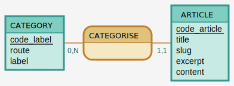

# Modèle de données

## MCD via mocodo

``` mocodo
CATEGORY: code_label, route, text
CATEGORISE, 11 ARTICLE, 0N CATEGORY
ARTICLE: code_article, title, slug,  excerpt, content
```



## MLD

- Article (<ins>id</ins>, title, abstract, year, cover, #category(id))
- Category (<ins>id</ins>, firstname, lastname)
